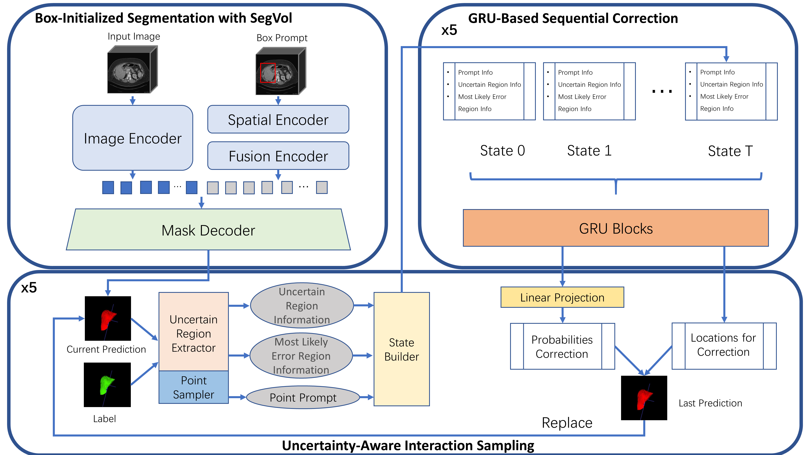
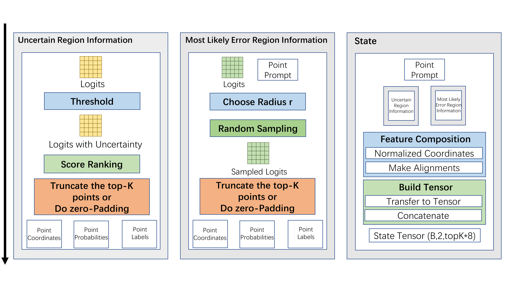
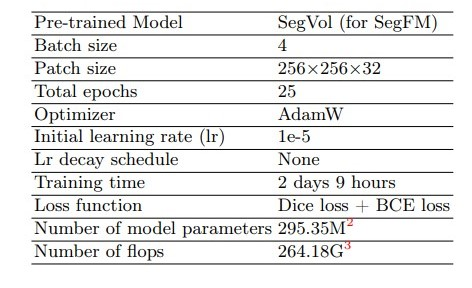
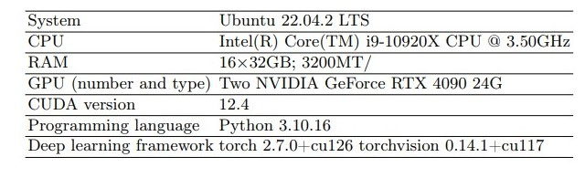

# sjtu_eiee_lab426 solution for CVPR2025 Chanllenge MedSegFM

# SegVol-GRU-Correction

This repository is based on [SegVol-for-SegFM](https://github.com/Yuxin-Du-Lab/SegVol-for-SegFM), and aims to extend it by incorporating a stateful GRU-based correction mechanism for sequential refinement in interactive medical image segmentation.

---

## 📌 Methods
Our framework consists of three core components:

1. **Box-Initialized Segmentation**  
2. **Uncertainty-Aware Interaction Sampling**  
3. **GRU-Based Sequential Correction**

  
*Figure: Three-stage pipeline. (a) SegVol generates initial mask from box prompt; (b) Uncertainty and error regions are sampled to build sequential state tensor for GRU; (c) GRU corrects predictions using sequential states.*

---

### 1. Box-Initialized Segmentation

Given volumetric input $\mathbf{I} \in \mathbb{R}^{D \times H \times W}$ and a bounding box $\mathbf{B}$, SegVol generates the initial segmentation mask:

$$
\mathbf{M}_0 = \text{SegVol}(\mathbf{I}, \mathbf{B}), \quad \hat{y}_0 = \mathbb{I}(\mathbf{M}_0 > 0.5)
$$

---

### 2. Uncertainty-Aware Interaction Sampling

We sample voxels requiring correction from:

- **Uncertainty regions**: Voxels with ambiguous probability ($|p - 0.5| < \tau$).
- **Most likely error regions**: Discrepancy around user clicks.

Uncertainty points:

$$
\mathcal{U}_t = \{(i,j,k) \mid \tau < p_t(i,j,k) < 1-\tau \}
$$

Error points (simulated from user click $c_n = (x_n, y_n, z_n)$ with label $l_n$):

$$
\mathcal{E}_t = \bigcup_{n} \{(i,j,k) \mid \| (i,j,k) - (x_n, y_n, z_n) \| \leq r,\; \hat{y}_t(i,j,k) \neq l_n \}
$$

Both sets are ranked and truncated or padded to $K=200$ voxels due to GPU constraints.

  
*Figure: Sampling workflow for uncertainty and error points.*

Each sampled point is represented by an 8D feature vector including:
- Normalized coordinates
- Probability or user label
- Padding mask
- First-click global context

These vectors form two feature matrices:
- $\mathbf{F}_t^{\text{unc}} \in \mathbb{R}^{K \times 8}$
- $\mathbf{F}_t^{\text{err}} \in \mathbb{R}^{K \times 8}$

They are concatenated into:
$$
\mathbf{X}_t = [\mathbf{F}_t^{\text{unc}}; \mathbf{F}_t^{\text{err}}] \in \mathbb{R}^{2K \times 8}
$$

The original coordinates are stored in:
$$
\mathbf{C}_t \in \mathbb{R}^{2K \times 3}
$$

---

### 3. GRU-Based Sequential Correction

The GRU processes the sequence of interaction states:

$$
\Delta p_t, \Delta \mathbf{C}_t = \text{GRU}_\theta(\{\mathbf{State}_0, \ldots, \mathbf{State}_T\}, \mathbf{h}_{t-1})
$$

- $\Delta p_t \in \mathbb{R}^{B \times 2K}$: predicted probability changes  
- $\Delta \mathbf{C}_t \in \mathbb{R}^{B \times 2K \times 3}$: coordinate refinements  

---

### Iterative Correction Pipeline

Each round of correction includes:

1. Predict initial mask from box prompt  
2. Sample $\mathcal{U}_t$ and $\mathcal{E}_t$ from prediction error  
3. Construct GRU input features $\mathbf{X}_t$ and coordinates $\mathbf{C}_t$  
4. GRU outputs updated logits $\Delta p_t$ and refined coordinates $\Delta \mathbf{C}_t$

Then, update the mask logits at corrected locations:

$$
\mathbf{M}_t^{(i,j,k)} = \Delta p_t^{(n)} \quad \text{for} \quad (i,j,k) \in \mathcal{C}_t
$$

where $\mathcal{C}_t$ is the refined coordinate set after applying $\Delta \mathbf{C}_t$.

### Network Architecture

- **Base Network**:  
  The base segmentation model adopts the SegVol volumetric encoder-decoder architecture, which generates initial segmentation masks from bounding box prompts.

- **Correction Module**:  
  A GRU-based sequential refinement module is introduced to correct boundary errors over multiple interaction steps.

  - **Input**:  
    At each interaction step, the GRU receives a feature tensor of shape $B \times 2 \times (K \times 8)$, where each of the $2K$ points encodes 8-dimensional features including normalized coordinates, prediction probabilities, binary labels, and user context information.

  - **GRU Unit**:  
    The GRU processes this temporal sequence and maintains a hidden state that captures the history of interactions.

  - **Coordinate Fusion**:  
    The GRU output is concatenated with flattened coordinate tensors of shape $B \times 6K$ to retain spatial alignment information.

  - **Output Layer**:  
    A fully connected layer produces $2K$ refined probability values corresponding to the selected voxel positions.

- **Total Number of Parameters**:  
  - GRU parameters depend on `input_size = K × 8` and a defined `hidden_size` (e.g., 256).
  - The FC layer includes parameters for transforming from `hidden_size + 6K` to `2K` outputs.

### Evaluation Metrics

We adopt the following metrics to evaluate segmentation performance:

- **Dice Similarity Coefficient (DSC)**
- **Hausdorff Distance (95th percentile)**
- **Average Surface Distance (ASD)**

👉 [Code reference for metrics: link-to-code or metrics.py]

---

## 🧪 Experiments

### Dataset

- **Dataset Name**: CVPR2025 SegFM3D
- **Source**:  
  - Public Dataset: 

### Preprocessing Steps  

Preprocessing follows the original SegVol pipeline.

### Training Protocols

Our training strategy builds on the SegVol pipeline, introducing enhanced augmentation, sampling, and interaction-aware optimization.
   
#### Data Augmentation

To improve generalization, we apply spatial and intensity-based augmentations:

- **Spatial Augmentation**:
  - Random flipping along sagittal, coronal, and axial planes (probability = 0.2 per axis).
  - Mixed input strategy: full-volume resizing or patch extraction (3:1 preference for patches).
  - Patch extraction via `RandCropByPosNegLabeld` with a 3:1 positive-to-negative sample ratio.

- **Intensity Augmentation**:
  - Random intensity scaling (±20%) and shifting (±20%), each applied with a 0.2 probability.

#### Data Sampling Strategy

We adopt a class-balanced and memory-efficient sampling approach:

1. **Foreground-aware cropping** ensures all available classes are represented.
2. **Patch-based sampling** prioritizes regions with segmentation targets (positive:negative = 3:1).
3. Ground truth masks are stored in sparse format to handle large 3D volumes.
4. Inference is performed on full volumes, with optional sliding windows for large scans.

#### Interactive Optimization Strategy

A two-stage training approach is designed to mimic real-world user interactions:

- **Stage 1**: Train with box prompts using global similarity losses to capture coarse structure.
- **Stage 2**: Add point prompts and fine-tune with boundary-sensitive losses (e.g., distance-based metrics).

To simulate clinical refinement behavior:

- Prioritize 2–3 GRU iterations during training.
- Assign lower probabilities to 1 or 4 steps, and rarely use 0 or 5 steps.
- Use sequential GRU updates with memory retention for realistic interaction modeling.

The optimization combines:

- Global structural similarity loss
- Voxel-wise prediction loss
- Consistency loss between initial and refined predictions

This ensures both stability during training and adaptability to varied clinical use cases.

### Testing

### Postprocessing

Postprocessing follows the original [SegVol-for-SegFM](https://github.com/Yuxin-Du-Lab/SegVol-for-SegFM) pipeline:

## Environments and Requirements
  

## Contributing

## Acknowledgement
We thank all the data owners for making the medical images publicly available and CodaLabfor hosting the challenge platform. 
